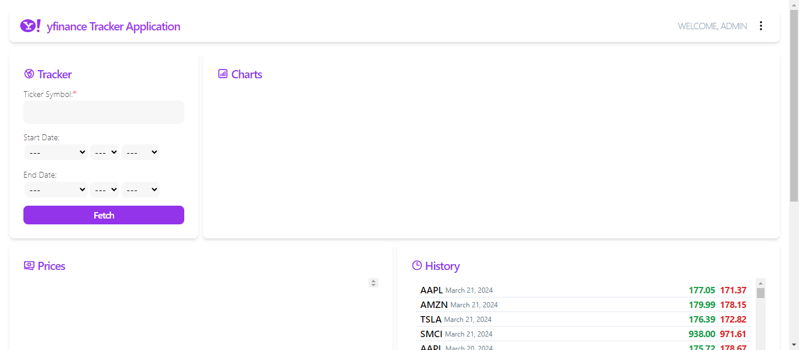
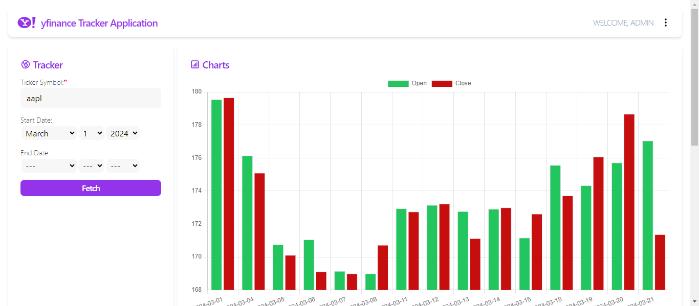
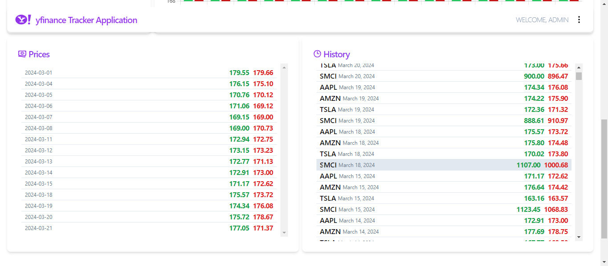
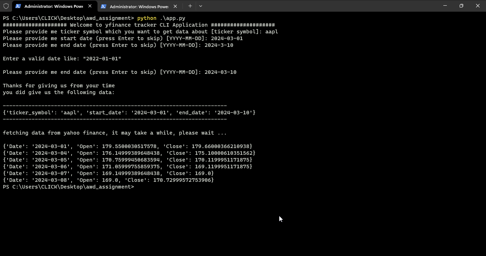

# SVU - Advanced Web Development (AWD) Assignment by PhD. Bassel Alkhateeb for F23

by Abdullah Altatan  
MCS_AWD_F23_C1_ABDULLAH_232943

Live Hosting: https://abdullahaltatan.pythonanywhere.com  
Github Repo: https://github.com/aaltatan/awd_assignment  
README.md File: https://github.com/aaltatan/awd_assignment/blob/main/README.md

## Installation

- ``` git clone https://github.com/aaltatan/awd_assignment.git ```
- ``` cd awd_assignment ```
- ``` npm install ```
- ``` pip install -r requirements.txt ```

## Technologies Used
- Python
- JavaScript
- Django Framework
- Tailwindcss Framework

## Project Structure

```
| .gitignore
| app.py
| db.sqlite3
| manage.py
| MCS_AWD_F23_Project.pdf
| package-lock.json
| package.json
| README.md
| requirements.txt
| tailwind.config.js
|   
+---node_modules
|       
+---static
|   +---css
|   |   +---dist
|   |   |       fetchForm.css
|   |   |       login.css
|   |   |       main.css
|   |   \---src
|   |           main.css
|   +---imgs
|   |       login.jpg
|   \---js
|           fetchData.js
|           
+---stockapp
|   |   admin.py
|   |   apps.py
|   |   controllers.py
|   |   forms.py
|   |   models.py
|   |   tests.py
|   |   urls.py
|   |   views.py
|   |   __init__.py
|   |   
|   +---migrations
|   |   |   0001_initial.py
|   |   |   0002_alter_stockdata_options_alter_stockdata_close_price_and_more.py
|   |   |   0003_alter_stockdata_close_price_and_more.py
|   |   |   __init__.py
|           
+---templates
|   |   base.html
|   |   
|   +---dashboard
|   |       index.html
|   |       
|   +---registration
|   |       login.html
|   |       logout.html
|   |       
|   \---_includes
|       |   Alert.html
|       |   Chart.html
|       |   FetchForm.html
|       |   Footer.html
|       |   History.html
|       |   Navbar.html
|       |   Prices.html
|       |   
|       \---icons
|               ArrowDown.html
|               ArrowUp.html
|               BankNote.html
|               ChartBar.html
|               Clock.html
|               Codepen.html
|               Dots.html
|               Facebook.html
|               Github.html
|               Globe.html
|               Spinner.html
|               Yahoo.html
|               
+---venv
|
\---_project
    |   asgi.py
    |   settings.py
    |   urls.py
    |   wsgi.py
    |   __init__.py

```
## Assignment Requirements

### HTML & CSS
i used Django templates for rendering html pages  in that structure

```
+---templates
|   |   base.html
|   |   
|   +---dashboard
|   |       index.html
|   |       
|   +---registration
|   |       login.html
|   |       logout.html
|   |       
|   \---_includes
|       |   Alert.html
|       |   Chart.html
|       |   FetchForm.html
|       |   Footer.html
|       |   History.html
|       |   Navbar.html
|       |   Prices.html
|       |   
|       \---icons
|               ArrowDown.html
|               ArrowUp.html
|               BankNote.html
|               ChartBar.html
|               Clock.html
|               Codepen.html
|               Dots.html
|               Facebook.html
|               Github.html
|               Globe.html
|               Spinner.html
|               Yahoo.html
```

i separated the templates into a reusable components which i included them into index.html to have a clean code.   
i create base.html to make index.html extends from it to be DRY.  
i also separated icons SVGs into components to reuse them where i want to.  
i create registration dir and create login.html and logout.html to make Django use them in login/logout mechanism.  

### Use CSS to style the page

for css i used the famous tailwindcss framework   
it's utility-first CSS framework  
personally i prefer it more than any other library or framework like bootstrap because it's providing more flexibility and customization, and it will generate a small css file (static/dist/main.css) rather than including whole library files into my project, to have more performance in my site.  

i configure it to sense any changes will happen in my .html files like that:  
```
/** @type {import('tailwindcss').Config} */
module.exports = {
  content: [
    './templates/*.html',
    './templates/**/*.html',
    './static/js/*.js'
  ],
  theme: {
    extend: {},
  },
  plugins: [],
}
```

and these are some images from my site, showing styles which i make:  





and i used pure css (static/dist/login.css, static/dist/fetchForm.css) also in styling formats because it's difficult to handle rendered html forms directly in django  

login page (pure css):  

<!--  -->


i design my website like a dashboard and also it's responsive  

.png)
.png)
.png)


### Python

i wrote a Python program that uses the `yfinance` library to 
fetch real stock data from Yahoo Finance.  

i separated the logic into multiple functions like:


first function (history):
it takes ticker_symbol, start_date and end_date as arguments  
and return a list of dictionaries including fetched data.  

``` stockapp/controllers.py ```
```
def history(ticker_symbol: str,
            start_date: str | None = None,
            end_date: str | None = None) -> list[dict] | None:
  "get open and close prices in specific period from yahoo finance"

  if not start_date:
     start_date: str = '2022-01-01'
  if not end_date:
     end_date: str = datetime.now().strftime('%Y-%m-%d')

  ticker = yf.Ticker(ticker_symbol.upper())
  hist: pd.DataFrame | None = ticker.history(start=start_date, end=end_date)

  if not len(hist):
    return None
  
  hist = hist[['Open', 'Close']]
  hist = hist.reset_index()
  hist = hist.to_dict(orient='records')
  hist = list(map(parse_date, hist))

  return hist
```

second function (parse_date):  
it's a utils function i used in previous one to help it parse the date from datetime object into str  

```
def parse_date(data: dict) -> dict:
  """
  parse the timestamp inside the dictionary into date-str format
  """
  timestamp: pd.Timestamp = data['Date']
  data['Date'] =  timestamp.strftime('%Y-%m-%d')
  return data
```

third function (information):  
it takes ticker_symbol as an argument and returns filtered information about the ticker by using Information Class which inherit from pydantic.BaseModel   

```
class Information(BaseModel):
  country: str | None = None
  currency: str | None = None
  longName: str | None = None
  symbol: str | None = None
  website: str | None = None
  zip: str | None = None
  totalCash: int | None = None
  totalDebt: int | None = None
  totalRevenue: int | None = None

def information(ticker_symbol: str) -> dict | None:
  """
  get basic information about ticker company
  """

  ticker: yf.Ticker = yf.Ticker(ticker_symbol.upper())
  data = ticker.get_info()

  if len(data) <= 1:
    return None
  
  data = Information(**data)

  return data.model_dump()
```

you can test them by running this command:  
``` python ./stockapp/controllers.py ```

fourth function (get_args):  
it will be responsible for getting user inputs and fetching the data

```
def get_args() -> dict[str, str | None]:

  "get valid user's inputs"

  date_regex: re.Pattern = re.compile(r'^20\d{2}-[0-1]\d-[0-3]\d')
  data: dict = {
    'symbol': {
      'input_msg': 'Please provide me ticker symbol which you want to get data about [ticker symbol]: ',
      'regex': re.compile(r'^[a-z]{4,10}$'),
      'error_msg': 'Enter a valid ticker symbol please, like: "AMZN", "AAPL", ...',
      'optional': False,
    },
    'start_date': {
      'input_msg': 'Please provide me start date (press Enter to skip) [YYYY-MM-DD]: ',
      'regex': date_regex,
      'error_msg': 'Enter a valid date like: "2022-01-01" ',
      'optional': True,
    },
    'end_date': {
      'input_msg': 'Please provide me end date (press Enter to skip) [YYYY-MM-DD]: ',
      'regex': date_regex,
      'error_msg': 'Enter a valid date like: "2022-01-01" ',
      'optional': True,
    },
  }

  text: str = ' Welcome to yfinance tracker CLI Application '
  greeting_msg: str = text.center(len(text) + 40, '#')

  print(greeting_msg)

  ticker_symbol: str = infinite_loop(**data['symbol'])
  start_date: str | None = infinite_loop(**data['start_date'])
  end_date: str | None = infinite_loop(**data['end_date'])

  return {
    'ticker_symbol': ticker_symbol,
    'start_date': start_date,
    'end_date': end_date
  }
```

fifth function (infinite_loop):  
it's a utils function i used in previous one to help it putting the user into an infinite loop until he give valid inputs.  

```
def infinite_loop(input_msg: str, 
                  regex: re.Pattern, 
                  error_msg: str, 
                  optional: bool = False) -> str | None:
  
  "put the user in infinite loop until he gives valid values"
  'registration'

  inputted: str = ''
  while True:
    inputted = input(input_msg)
    if not inputted and optional:
      return None
    if not regex.search(inputted):
      print(f'\n{error_msg}\n')
    else:
      break
  return inputted
```

sixth and final function (main):  
which is basically the CLI app

```
def main() -> None:
  user_inputs: dict = get_args()
  print('\nThanks for giving us from your time\nyou did give us the following data:\n')
  print('-' * 70)
  print(user_inputs)
  print('-' * 70)
  print('\nfetching data from yahoo finance, it may take a while, please wait ...\n')
  hist: list[dict] = history(**user_inputs)
  if hist:
    for row in hist:
      print(row)
```

you can test the CLI app by running this command

``` python ./app.py ```

result:



### Django

first i create an app (stockapp) with this command:  
```python ./manage.py startapp stockapp```

after that i modified the ```./_project/settings.py``` with these lines:  

```./_project/settings.py```

to make Django know the new app which i add

```
INSTALLED_APPS = [
    'stockapp', # add this
    'django.contrib.admin',
    'django.contrib.auth',
    'django.contrib.contenttypes',
    'django.contrib.sessions',
    'django.contrib.messages',
    'django.contrib.staticfiles',
]
```

to make Django knows the 'templates' Dir  

```
TEMPLATES = [
    {
        'BACKEND': 'django.template.backends.django.DjangoTemplates',
        'DIRS': ['templates'], # add this
        'APP_DIRS': True,
        'OPTIONS': {
            'context_processors': [
                'django.template.context_processors.debug',
                'django.template.context_processors.request',
                'django.contrib.auth.context_processors.auth',
                'django.contrib.messages.context_processors.messages',
            ],
        },
    },
]
```
to make Django knows the 'static' Dir  

```
STATICFILES_DIRS = [
  BASE_DIR / 'static',
]
```

then i write StockData model into ``` stockapp/models.py ``` like this:

```
from django.db import models
from django.core.validators import MinValueValidator


price_validators = [
  MinValueValidator(0, 'Price must be greater than zero')
]

class StockData(models.Model):
  ticker_symbol = models.CharField(max_length=10)
  date = models.DateField()
  open_price = models.DecimalField(max_digits=10, 
                                   decimal_places=2,
                                   validators=price_validators)
  close_price = models.DecimalField(max_digits=10, 
                                    decimal_places=2,
                                    validators=price_validators)

  class Meta:
    verbose_name_plural = 'Stocks Data' # admin site config

  def save(self, *args, **kwargs) -> None:
    self.ticker_symbol = self.ticker_symbol.upper() # to force saving ticker_symbol in uppercase
    return super().save(*args, **kwargs)

  def __str__(self) -> str:
    attr: list[str] = [
      f'ticker_symbol={self.ticker_symbol}',
      f'date={self.date}',
      f'open_price={self.open_price}',
      f'close_price={self.close_price}',
    ]
    return f'Ticker({", ".join(attr)})'
```

then i registered the model in ``` stockapp/admin.py ``` and make some configurations to show it probably in admin site:  

```
from django.contrib import admin
from .models import StockData

@admin.register(StockData)
class StockDataAdmin(admin.ModelAdmin):
  list_display = ['ticker_symbol', 'date', 'open_price', 'close_price']
  list_filter = ['ticker_symbol']
  search_fields = ['ticker_symbol']
  ordering = ['-date']
  list_per_page = 10 
```

then i create a super user by running this command to ability to login in admin site:  

``` python ./manage.py createsuperuser ```

then i create the only view in my project to handle rendering html page and handle POST request which will be came to it from client side (JavaScript):  

``` stockapp/view.py ```

```
from django.shortcuts import render
from django.http.request import HttpRequest
from django.http import HttpResponse, JsonResponse
from django.contrib.auth.decorators import login_required
from . import forms
from datetime import datetime
from .controllers import history
from .models import StockData
from typing import Iterable


@login_required
def index(request: HttpRequest) -> HttpResponse:

  if request.method == 'POST':

    form = forms.StockForm(request.POST)

    if form.errors:
      errors = form.errors.as_json()
      return JsonResponse(data=errors, safe=False, status=400)

    if form.is_valid():

      start_date = form.cleaned_data.get('start_date')
      end_date = form.cleaned_data.get('end_date')

      if start_date:
        start_date = datetime.strftime(start_date, '%Y-%m-%d')
      if end_date:
        end_date = datetime.strftime(end_date, '%Y-%m-%d')

      data = {
        'ticker_symbol': form.cleaned_data.get('ticker_symbol'),
        'start_date': start_date,
        'end_date': end_date,
      }

      data = history(**data)
      status: int = 200 if data else 400

      if data:
        for row in data:
          row_data: dict = {
            'ticker_symbol': form.cleaned_data.get('ticker_symbol'),
            'date': datetime.strptime(row['Date'], '%Y-%m-%d'),
            'open_price': round(row['Open'], 2),
            'close_price': round(row['Close'], 2),
          }

          row_exists: StockData | None = (
            StockData
            .objects
            .filter(ticker_symbol=row_data['ticker_symbol'].upper(), date=row_data['date'])
            .first()
          )

          if not row_exists:
            StockData.objects.create(**row_data)


      return JsonResponse(data=data, safe=False, status=status)
    
  else:
    form = forms.StockForm()

  data: Iterable[StockData] = (
    StockData
    .objects
    .all()
    .order_by('-date')
  )

  return render(
    request=request,
    template_name='dashboard/index.html',
    context={
      'form': form,
      'data': data
    }
  ) 
```

then i register the view in ``` stockapp/urls.py ``` like this:

```
from . import views
from django.urls import path

urlpatterns = [
  path(route='', view=views.index, name='index'),
]
```

then i register the app urls in ``` _project_/urls.py ``` like this:

```
from django.contrib import admin
from django.urls import path, include

urlpatterns = [
    path('admin/', admin.site.urls),
    path('', include('stockapp.urls')), # add this
    path('accounts/', include('django.contrib.auth.urls')) # for login/logout mechanism,
]
```

then i add those lines into ``` _project/settings.py ``` to make Django knows redirect urls for login/logout:  

```
LOGIN_REDIRECT_URL = '/'
LOGOUT_REDIRECT_URL = '/accounts/login'
```

### JavaScript

i wrote a script to handle sending POST request to the endpoint to get json fetched data and create some elements in page like this:

```
const tickerForm = document.getElementById("ticker-form");
const spinner = document.getElementById("spinner");
const tickerSymbol = document.querySelector("#id_ticker_symbol");
const alertContainer = document.getElementById("alert");
const alertCloseBtn = document.getElementById("alert-close-btn");
const pricesContainer = document.getElementById('prices-container');
let chart;

alertCloseBtn.addEventListener("click", () => {
  alertContainer.classList.add("hidden");
  alertContainer.classList.remove("flex");
});

tickerForm.addEventListener("submit", (e) => {
  e.preventDefault();
  const regex = /^[a-z]{4,10}$/;

  if (!tickerSymbol.value.match(regex)) {
    makeAlert('Please Enter a valid symbol like: "aapl", "amzn"');
    return;
  }

  spinner.classList.remove("hidden");

  const formData = new FormData();

  tickerForm.querySelectorAll("*[id]").forEach((element) => {
    let key = element.id.replace("id_", "");
    let value = element.value;
    formData.append(key, value);
  });

  let csrfToken = document.querySelector('input[type="hidden"]');
  formData.append("csrfmiddlewaretoken", csrfToken.value);

  fetchData(formData);
});

async function fetchData(formdata) {
  const response = await fetch("/", {
    method: "POST",
    body: formdata,
  });
  if (response.status === 200) {
    spinner.classList.add("hidden");
  }
  if (response.status !== 200) {
    spinner.classList.add("hidden");
    let error = await response.json();
    error = JSON.parse(error) ? JSON.parse(error).start_date[0].message : "Error";
    let message = error + "\nBad Request, Please make sure from you data";
    makeAlert(message);
    tickerSymbol.focus();
    return;
  }

  const data = await response.json();

  let dates = [];
  let openPrices = [];
  let closePrices = [];

  pricesContainer.innerHTML = '';

  data.forEach((row) => {
    let { Date: date, Open: open, Close: close } = row;
    dates.push(date);
    openPrices.push(open);
    closePrices.push(close);
    let rowDiv = createPricesRow(row);
    pricesContainer.appendChild(rowDiv);
  });

  makeChart(dates, openPrices, closePrices)

}

function makeAlert(message) {
  const p = alertContainer.querySelector("p");
  const text = document.createTextNode(message);
  p.innerHTML = "";
  p.appendChild(text);
  alertContainer.classList.remove("hidden");
  alertContainer.classList.add("flex");
}

function makeChart(yLabels, openPrices, closePrices) {

  const ctx = document.getElementById("myChart");

  let configurations = {
    type: "bar",
    data: {
      labels: yLabels,
      datasets: [
        {
          label: 'Open',
          data: openPrices,
          borderWidth: 1,
          backgroundColor: "#22c55e",
        },
        {
          label: "Close",
          data: closePrices,
          borderWidth: 1,
          backgroundColor: "#c70e0e",
        },
      ],
    },
    options: {
      scales: {
        y: {
          beginAtZero: false,
        },
      },
    },
  };

  if (chart) {
    chart.destroy()
    chart = new Chart(ctx, configurations);
  } else {
    chart = new Chart(ctx, configurations);
  }
}

function createPricesRow(row) {
  const mainDiv = document.createElement('div');
  mainDiv.setAttribute('class', 'flex items-center hover:bg-slate-200 px-2');
  
  const dateSpan = document.createElement('span');
  dateSpan.setAttribute('class', 'text-xs text-slate-500');
  dateSpan.innerHTML = row.Date;
  mainDiv.appendChild(dateSpan);

  const pricesDiv = document.createElement('div');
  pricesDiv.setAttribute('class', 'ml-auto flex items-center font-bold tracking-tighter gap-2');

  const openSpan = document.createElement('span');
  let openSpanText = document.createTextNode(row.Open.toFixed(2))
  openSpan.setAttribute('class', 'text-green-600');
  openSpan.setAttribute('title', 'open');
  openSpan.appendChild(openSpanText);
  pricesDiv.appendChild(openSpan);

  const closeSpan = document.createElement('span');
  let closeSpanText = document.createTextNode(row.Close.toFixed(2))
  closeSpan.setAttribute('class', 'text-red-600');
  closeSpan.setAttribute('title', 'close');
  closeSpan.appendChild(closeSpanText);
  pricesDiv.appendChild(closeSpan);

  mainDiv.appendChild(pricesDiv);

  return mainDiv;
}
```

i used chartjs (cdn version) library to creating a plot which representing the data i fetched
```
<script src="https://cdn.jsdelivr.net/npm/chart.js"></script>
```

i wish the project describe it self if i missing something in this report.  


thanks for reading.
